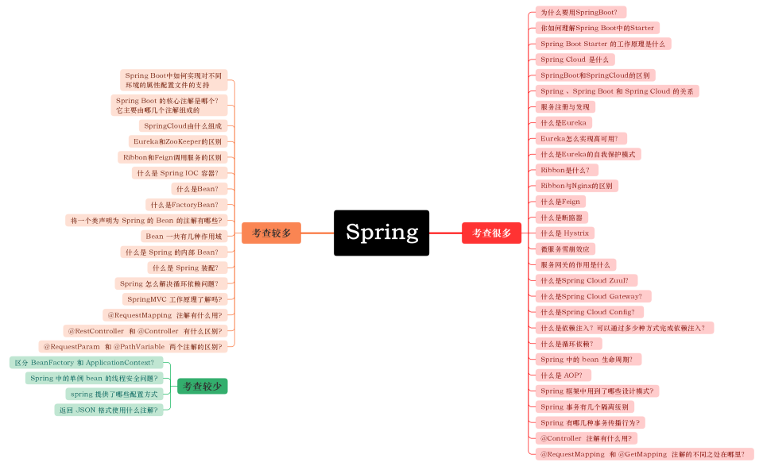

Spring生态
---

## Spring
#### 1使用Spring框架的好处
* 控制反转：Spring通过控制反转实现了松散耦合，对象们给出它们的依赖，而不是创建或查找依赖的对象们
* 面向切面的编程(AOP)：Spring支持面向切面的编程，并且把应用业务逻辑和系统服务分开 容器：Spring 包含并管理应用中对象的生命周期和配置
* MVC框架：Spring的WEB框架是个精心设计的框架，是Web框架的一个很好的替代品
* 事务管理：Spring 提供一个持续的事务管理接口，可以扩展到上至本地事务下至全局事务（JTA）
* 异常处理：Spring 提供方便的API把具体技术相关的异常（比如由JDBC，Hibernate or JDO抛出的）转化为一致的unchecked 异常
* 非侵入式设计：Spring是一种非侵入式(non-invasive)框架，它可以使应用程序代码对框架的依赖最小化
#### 2什么是Spring容器
