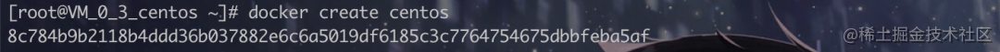

#Docker

---
[掘金帖子](https://juejin.cn/post/6844904117165359111)

docker 🐳 作为容器化技术的代言人。 由于应用程序的运行被隔离在了一个独立的运行环境之中，这个独立的运行环境就好似一个容器，包裹住了应用程序，这就是容器技术名字的由来。 而docker相比于虚拟机有几个特点：

* 启动速度快
* 更轻量

Docker容器技术：
- 让用户享受无缝便携
- 提供轻量级更新
- 提供自动容器创建
- 提供容器版本控制
- 有容器重用
- 支持共享容器库

### docker的内部组件
**NameSpace** 命名空间，提供一种对进程隔离的一种机制，例如进程，网络、挂载等资源

**ControlGroups** 资源控制组的作用就是控制计算机资源的，与namespace不同CGroups 主要做的是硬件资源的隔离

**Union File System**  联合文件系统，支持将不同位置的目录挂载到同一个虚拟文件系统，形成一种分层的模型

### docker的核心组成
在docker体系中，有三大核心组件，它们分别是： 镜像 ( Image )、 容器 ( Container ) 、仓库（Registry）
### 镜像（Image）
镜像是一个特殊的文件系统，可以理解为一个只读包，甚至可以理解为类与实例中的类。 每个镜像可能有多个镜像组成。 它是一种层级结构，每次对镜像的修改，docker都会铸造成一个镜像层。
### 容器（Container）
容器可以理解为类与实例中的实例，镜像是死的是不可变的。 而容器却是一个活的空间。 每次启动容器都是通过镜像启动一个新的容器。
### 仓库（Registry）
远端的镜像仓库，例如npm仓库

### 安装docker
官网：https://www.docker.com/
### docker的运行过程
docker的运行过程可以简单的理解为，从远端仓库中拉取合适的镜像到本地-->通过镜像创建容器-->启动容器

使用docker
---
### docker search (查看远端库的镜像)
跟 npm search 类似，用来查看远端中的镜像，例如:
`docker search ubuntu`
他有几个参数：

| param       | mean   |
|-------------|:-------|
| NAME        | 镜像名字   |
| DESCRIPTION | 描述信息   |
| STARS       | 星星数量   |
| OFFICIAL    | 是否官方版本 |
| AUTOMATED   | 是否是自制的 |

### docker pull (拉取镜像)
从远端仓库中拉取镜像到本地,这里以 centos 镜像为例
`docker pull centos `
等到拉取成功后会出现下图所示：

当你不指定任何标签的时候，docker会默认拉取最新的tag，指定拉取 ：+ tag 例如:docker pull centos:7 每一个镜像都是由一组64位长度的hash码组成，这种组成的方式保证了全球的唯一性
### docker images(查看镜像)
从远端拉取镜像成功后我们可以通过docker images 来列出本地所有的镜像
`docker images`
如图下所示：

这边的image id 为12位和上方说的64位长度并不冲突，只是官方为了显示在控制台上好看一些。 将后方的位数省略了。
### docker create (创建容器)
如果说镜像是个类，那么我们需要创建一个实例来让我们操作。 通过
`docker create centos
`
来创建一个centos的容器，创建成功后会生成一个64位的hash值，如图下：

如果当你本地没有centos的镜像时候，会默认从远端仓库中的拉取对应的版本。 我们还可以通过 --name 来指定容器的别名

### 其他命令

| command                   | mean           |
|---------------------------|:---------------|
| docker ps                 | 查看容器           |
| docker start  stop  reset | 启动/停止/重启容器     |
| docker run                | 创建并启动容器        |
| docker exec               | 在运行的容器中执行命令    |
| docker rmi                | 删除容器或者镜像       |
| docker inspect            | (获取容器/镜像的元数据   |
| docker save load          | 导出镜像/导入镜像      |
| docker export import      | 导出容器/导入容器      |
| docker cp                 | 用于容器与主机之间的数据拷贝 |
| docker logs               | 获取容器的日志        |
| docker port               | 查看容器映射端口情况     |
| docker volume ls          | 列出当前已经创建的数据卷   |
| docker history            | 查看镜像的创建历史      |
| docker diff               | 检查容器里文件结构的更改   |
| docker kill               | 杀掉一个运行中的容器     |
| docker login              | 登陆远端镜像仓库       |
| docker push               | 将本地镜像上传到远端仓库   |

制作镜像
---
........